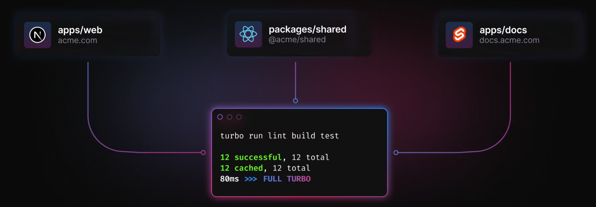
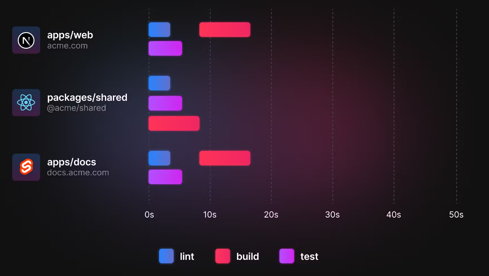
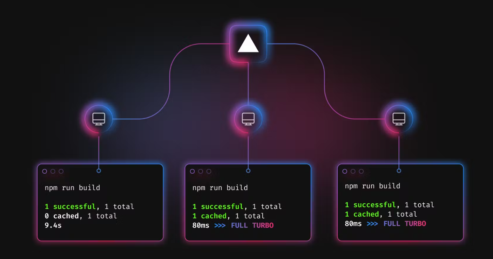
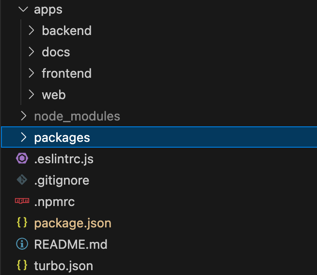

회사에서나 개인적으로나 프로젝트를 진행하다보면 라이브러리 관리에 프론트엔드 레포지트리에 백엔드에...여러개로 나뉘어진 도메인을 개발경험을 향상시키기 위해 모노레포를 적용하기로 했다.

## 1. 모노레포란?

모노레포는 동일 저장소 (레포지토리)에 여러개의 프로젝트를 저장하는 개발 방법이다. 

### 모놀리식
모놀리식 아키텍쳐는 단 하나의 저장소로 관리가 되고기 때문에 모든 기능이 결합되기 때문에 재사용이 용이하고 빌드, 배포과정이 비교적 단순하지만 서비스 규모가 점점 커질수록 개발 및 배포속도가 현저히 낮아진다. 결합성이 높아 관심분리가 힘들고 확장하기 어렵다는 단점이 있다. 

### 멀티레포
모놀로식 아키텍쳐의 단점을 해결하고자 각 관심사를 별도 저장소로 분할하여 관리하는 방식이다. 각 모듈이 서로 독립적인 영역이므로 리소스의 재사용 및 공유가 어렵다는 큰 단점이 있다.

위 두가지 방식의 장점을 활용하고자 새로운 방식인 **모노레포**가 등장했다.

### 모노레포
여러개의 개별 프로젝트를 하나의 저장소에서 관리하는 방식이다. 

1. 하나의 저장소에서 관리되기 때문에 의존성을 파악하기 용이하다.
2. 개발 히스토리가 하나의 레포지토리에 남기 때문에 개발 의도를 파악하기 용이하다.
3. 중복되는 코드를 공유 및 재사용할 수 있다.
4. 빌드, 배포 등과 같은 작업을 병렬 방식으로 한 번의 명령으로 처리가 가능하다.


## 2. Turborepo

모노레포 구축을 위한 다양한 시스템이 있지만 Vercel에서 인수한 JavaScript, TypeScript를 베이스로 한 빌드시스템을 활용해보려고 한다. 초기 설정이 쉽다는 장점과 함께 캐싱이 가능하고 빌드 속도가 빠르다는 장점이 있기 때문이다.

### 특징

1. Incremental builds: 이미 수행된 작업은 캐싱하고, 같은 작업은 수행하지 않는다.
<p align="center" style="color:gray">
    
    수행된 작업에 대한 캐싱
</p> 
2. Content-aware hashing: 내용을 기반으로 캐싱한다.
3. Parallel execution: 작업을 순차적 수행이 아닌 병렬로 수행한다.
<p align="center" style="color:gray">
    
    작업 병렬 처리
</p> 
4. Remote Caching: 원격에서 수행한 작업에도 캐싱이 가능하고, 동일한 머신에서 수행한 작업이 아니더라고 중복 작업을 수행하지 않는다.
<p align="center" style="color:gray">
    
    로컬 기반이 아닌 원격 기반의 캐싱
</p> 


### 그렇다면 왜 Turborepo인가?
- 단 한줄의 명령어로 실행시킬 수 있다는 편리함
- 최초 러닝커브가 비교적 낮은 편이고 세팅이 쉬운편이다.
- 배포시 가장 큰 장점인 중복 작업을 최소화 하고 시간이 줄어든다.

모노레포 구축을 위한 여러가지 도구를 사용해보면서 위 3가지의 다가온 큰 장점이 Turborepo를 활용하게 되었다.

### 구성

<p align="center" style="color:gray">
    
</p> 

- **apps**: 실행되는 앱
- **packages**: 공통 사용 패키지 모음. esling, tsconfig, ui가 기본적으로 설정
- **turbo.json**: 작업 수행을 설정할 수 있는 파일


#### 공통 패키지 환경 구성
예시로 프로젝트에 공통으로 사용될 타입을 정의하고 각 워크스페이스에서 사용해서 쓰도록 구성해보려고 한다.

1. packages 디렉토리에 types 폴더를 생성하고 package.json파일에 필요한 설정을 한다.
```
{
  "name": "@repo/types",
  "main": "./dist/index.js",
  "types": "./dist/index.d.ts",
  "dependencies": {
    "tsconfig": "*"
  },
  "devDependencies": {
    "typescript": "latest"
  },
  "scripts": {
    "build": "tsc"
  }
}
```

- name: 해당 패키지 이름
- main: 패키지 메인 파일
- types: 패키지 타입 파일
- dependencies: 해당 패키지가 의존하는 패키지이다.
- devDependencies: 개발환경에서만 사용하는 패키지이다.
- scripts: 해당 패키지에서 사용할 스크립트이다.

2. 해당 패키지를 불러와서 frontend에서 사용할 수 있도록 설정한다.
```
{
  "name": "frontend",
  ...
  "dependencies": {
    "@repo/types": "workspace:^"
  }
  ...
}
```

위 의존패키지를 확인해보면 @repo/types 패키지가 설치되어 있고 해당 워크스페이스에서 사용할 수 있다. 

```
$ yarn workspace frontend add @repo/types // 설치 명령어
```
